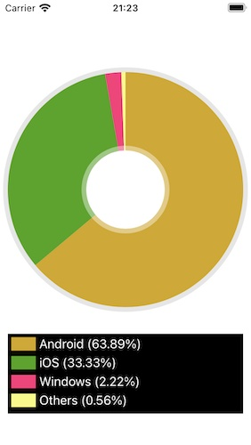

# TomatoAnimatedPieChart

<h2>Development and compatibility</h2>

Development platform: iOS 
Language: Swift 
UI framework: UIKit 
Compatibility: iOS 11 or greater 

<h2>Description</h2>

TomatoAnimatedPieChart Framework lets you create a simple 2D pie chart.  Each pie in the chart will increase its size in animation.  The following is a list of features.

<ol>
<li>Create a pie chart with colors of your selection.</li>
<li>Adjust the animation speed.</li>
<li>Show the name of each pie at the bottom.</li>
</ol>

<h2>Installation</h2>

1. In order to use this framework, download the sample project.  You will find the folder titled **TomatoAnimatedPieChart** in it.  Locate the Xcode file inside.  And put this Xcode file in your Xcode project.  Select your target and make sure you have **TomatoPieChartFramework.framework** under General > Framworks, Libraries, and Embeded Content as shown below.

2. In the view controller where to show a pie chart, create an array of chart models with **TomatoChartModel**.  This struct takes four properties: name (String), percentage (CGFloat), color (UIColor) and end (CGFloat).  The **name** property is the name of a pie.  The **percentage** property refers to the share of the pie.  The **color** property, of course, refers to the color of the pie.  The last one (**end**) is used by the framework.  So set it to 0.0 or any number.

<h2>Variables</h2>

<li>starter: It's the very degree where the first pie starts.  If you want the first pie to start at 0 o'clock, set it to 0.</li>
<li>topSpace: It is the space between the top edge of the view with or without the navigation controller and the chart.</li>
<li>radius: It's the radius of the pie chart.</li>
<li>pieThickness: It's the thickness (stroke length) of the pie.</li>
<li>innerBorder: It's the thickness of the translucent ring around the hole</li>
<li>outerBorder: It's the outer border thickness of the pie chart.</li>
<li>innerAlpha: It's the opacity level of the translucent ring around the hole.  If you set it 1, this ring will become completely white.</li>
<li>outerBorderColor: It's the color of the outer border.</li>
<li>rectWidth: It's the width of the color rectangle in the title container.</li>
<li>labelHeight: It's the height of the label of the pie name.</li>
<li>labelFontSize: It's the font size of the pie name label.</li>
<li>labelTextColor: It's the text color of the pie name label.</li>
<li>labelSpace: It's the vertical space between two pie name labels.</li>
<li>decimalNum: This number (0, 1, 2 or 3) determines how many decimal points you want to have in indicating the share of each pie.</li>
<li>titleContainerWidth: It's the width of the title container.</li>
<li>titleContainerBackColor: It's the background color of the title container.</li>
<li>titleContainerLayerCornerRadius: It's the corner radius of the title container.</li>
<li>titleContainerBottomSpace: It's the space between the title container and the bottom edge of the view.</li>
<li>animationDuration: It's the duration of the animation.</li>
